# An Administration Handbook of AI Lab's HPC Cluster

## Login to the cluster

### Direct login using SSH command

You can use the `ssh` command to log in to the cluster's management node (137.189.75.110). The login command is: 

```
    ssh <username>@<hostname>
```

On the first login, the system will prompt you to change your password. Please follow the instructions to modify your it.

### Remote login using VS Code

You can also use plugins provided by VS Code (or Cursor, etc.) to log in remotely. In VS Code, you can use Remote-SSH plugin:

1. Search and install the `Remote-SSH` plugin.

2. Add a remote host. 

   In the Remote Explorer on the left, click the "+" icon, select "Add New SSH Host", then enter the corresponding ssh command. 
   
   After entering the command, you will be asked to select the SSH configuration path. Choose according to your actual situation.
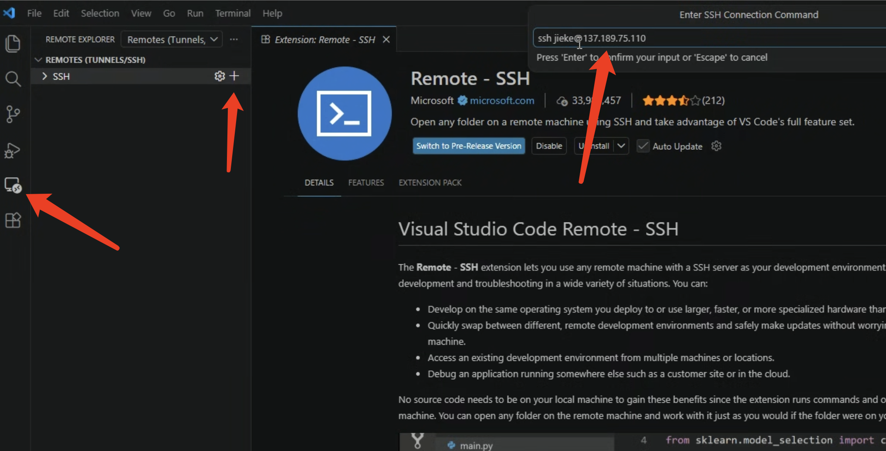
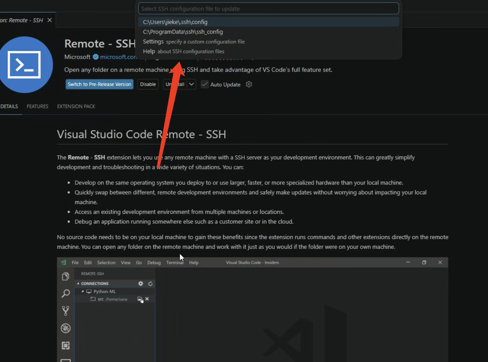

3. After adding the remote host, you can select the corresponding host from the list on the left and start the connection.
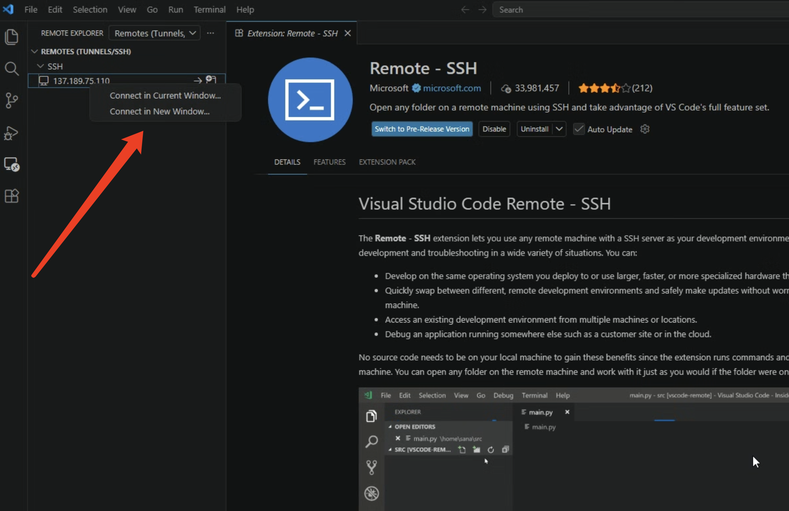

   If asked to choose the platform type of the remote host, select `linux`.
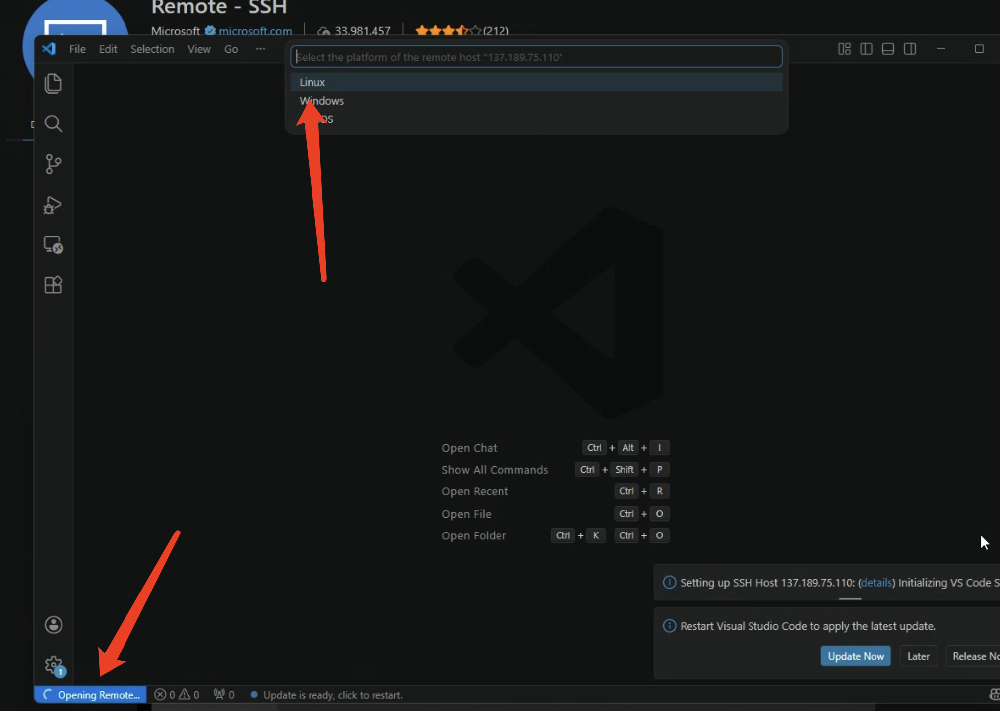

    Enter the password when prompted.
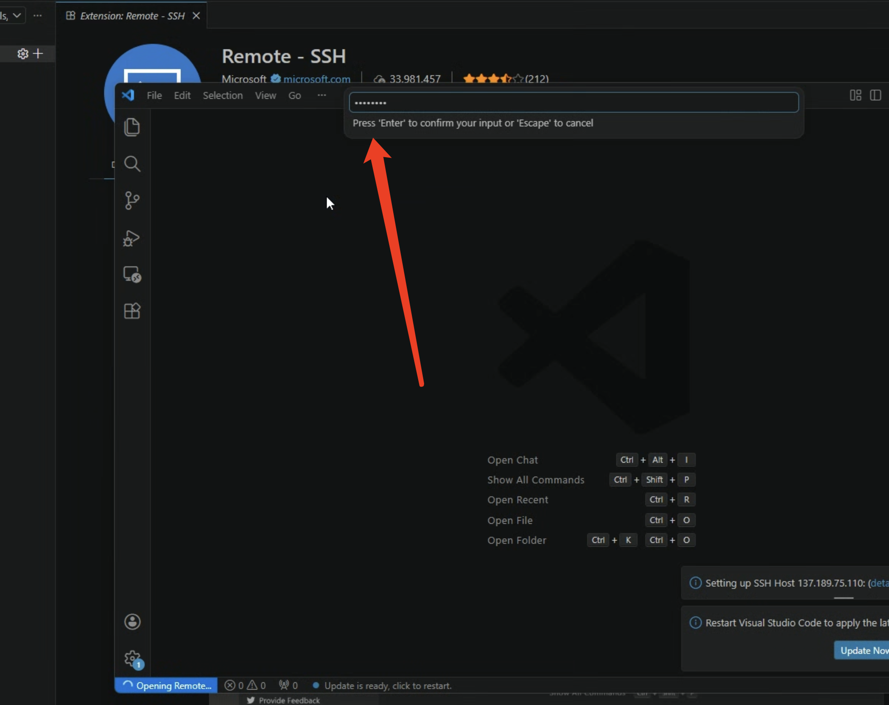

4. The first connection usually takes from tens of seconds to a few minutes. Once the connection is successfully established, you can choose to open a directory on the server and begin your subsequent work.
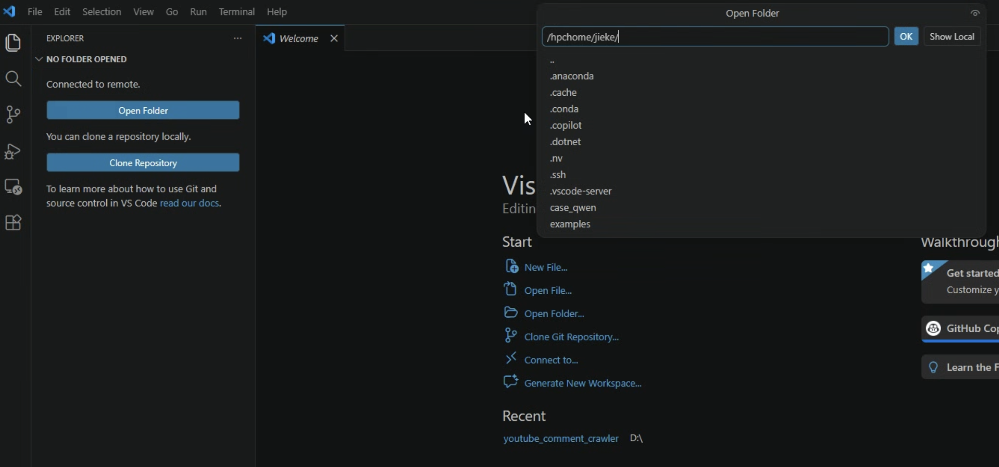

### Upload data

For small amounts of data, you can upload directly by dragging and dropping in VS Code.

For large amounts of data, you can use the `scp` command to upload. Additionally, there are plugins in VS Code that support `SFTP`; you can search for them in the plugin marketplace.

## Prepare your environment

### Load modules

For some modules in the system, users can load the corresponding items according to their actual needs, such as anaconda, cuda, etc. 

The following are introductions to some commonly used commands.

- `module avail`: List all available modules.
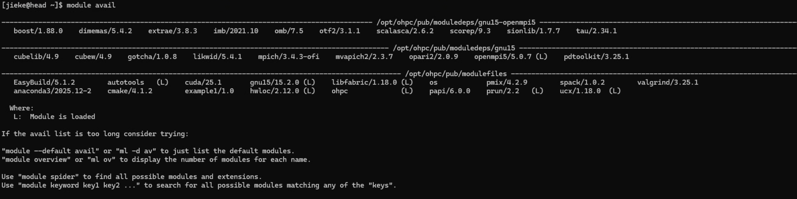

- `module list`: List currently loaded modules.
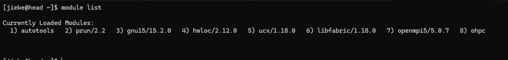

- `module load <module_name>`: Load the specified module. 

  Generally, `anaconda`, `cuda`, `nvhpc`, etc. are commonly used modules. If you cannot remember the exact module name, you can use the `Tab` key for auto-completion.
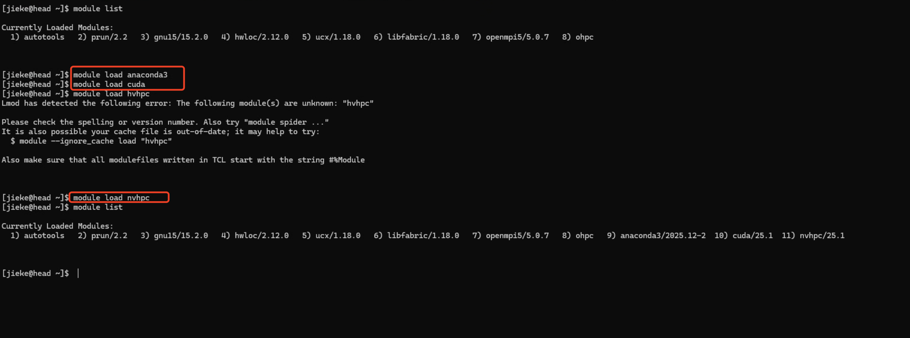

- `module unload <module_name>`: Unload the specified module.

### Prepare Conda environment

After loading the anaconda module using the `module` command, you can normally perform all anaconda operations:

- `conda create -n <env_name> python=<version>`: Create a virtual environment.

- `conda activate/deactivate`: Activate/deactivate a virtual environment.

After activating the virtual environment, users can install required packages via conda or pip.

## Prepare your scripts and data

Besides writing your Python scripts, generally you also need to prepare an sbatch script. 

In this script, users need to perform some basic configurations, such as job name, resource consumption, etc., and call the entry Python script for the business. 

Specific writing methods can refer to the examples provided.
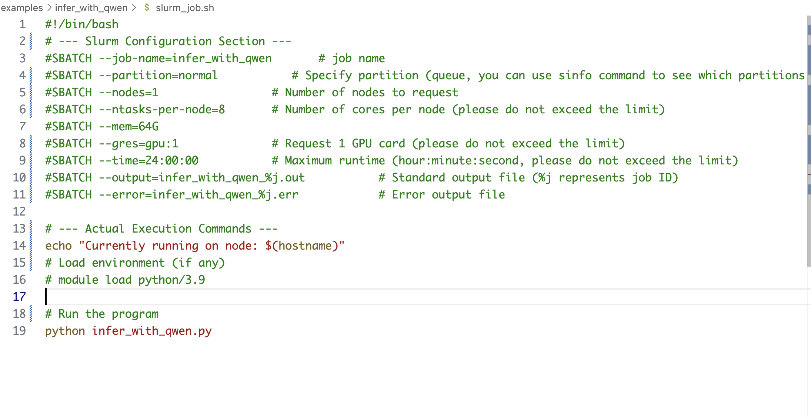

## Using slurm to submit jobs

### Debug your code

When you need to debug code rather than running long tasks, do not submit scripts directly. You can use 

```
srun --gres=gpu:1 --mem=64G --pty bash
``` 

to request an interactive terminal with GPU, and then operate like a normal server inside.
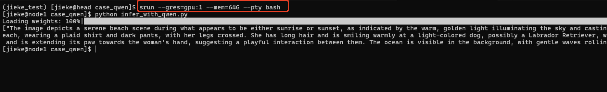

> ⚠️ Note: Since compute nodes have no internet connection, users must install packages and components requiring internet access in advance on the management node. During debugging, if missing dependencies are discovered, you need to exit back to the management node for installation, then re-enter the compute node for debugging.

> 💡 A tip: If you need to use models from huggingface, you can first try running the Python script on the management node. After the model download completes (you can manually kill the process), modify the model loading part in the code, adding `local_files_only=True`. Specific script content can refer to `examples/infer_with_qwen/infer_with_qwen.py`.

### Submit your job
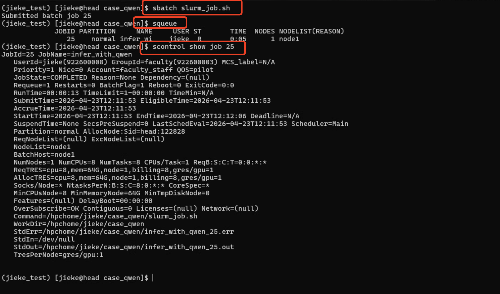

If you find that the job configuration is wrong (refer to [Resource Quote](#resource-quote)), immediately usec`scancel <JOBID>` to cancel it, releasing resources for others.

If a job remains in PD (Pending) status for a long time, use `squeue -j <JOBID>` or `scontrol show job <JOBID>` to check the Reason field. Common reasons include Resources (insufficient resources), Priority (low priority), or QOSMaxNodePerUserLimit (exceeding user quota).

After the job ends, you can check the content of files specified by `#SBATCH --output` and `#SBATCH --error` in the sbatch script to view program output.

### Some common slurm commands

| Command | Description | Common Parameter Examples |
| :--- | :--- | :--- |
| sinfo | View cluster node and partition status | `sinfo -p gpu` (view GPU partition)<br>`sinfo -N` (display by node) |
| squeue | View job queue (queued/running) | `squeue -u username` (view your own jobs)<br>`squeue -t R` (only view running jobs) |
| sbatch | Submit batch job script | `sbatch job.sh`<br>`sbatch -p cpu job.sh` |
| scancel | Cancel/delete job | `scancel <JOBID>`<br>`scancel -u username` (cancel all jobs of a user) |
| sacct | View historical records of finished jobs | `sacct -j <JOBID>` (check specific job)<br>`sacct -u username` |
| scontrol | View detailed information of jobs or nodes | `scontrol show job <JOBID>`<br>`scontrol show node <NODELIST>` |
| srun | Interactive job submission (for debugging) | `srun -p Interactive --pty bash` (request interactive terminal) |

# Resource quote

In the pilot phase, each user's resource limits are as follows:
| Item | Limit |
|------|-------|
| CPU  | 16 cores |
| GPU  | 1 H100 GPU |
| Memory | 128GB |